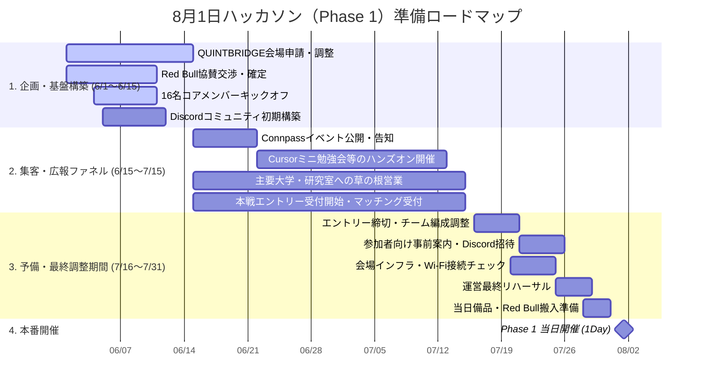

# 📅 8月1日ハッカソン（Phase 1）に向けた準備ガントチャート ＆ 詳細ロードマップ

本資料は、**8月1日のハッカソン（Phase 1）当日の大成功**に向け、6月1日から7月中旬までの「約1.5ヶ月の準備期間」、および7月下旬の「予備期間」におけるタスクとスケジュールを可視化した準備計画書です。

16名の運営メンバー（事務局）が各ユニットごとに自立的に動き、漏れなく直前準備を完了できるように設計されています。

---

## 📊 1. ガントチャート（Mermaid表示）

---

## 📝 2. 時系列タスク・マイルストーン詳細

### 🟢 【第1期】企画・基盤構築期間（6月1日 〜 6月15日）
運営メンバー16名がアライメントを揃え、イベントの実行に必要な「場所」と「インフラ」を確実に押さえるフェーズです。

- **QUINTBRIDGE会場申請・調整（共同代表PM / 会場ロジ）**
  - 8月1日の無償利用枠の申請および日程仮押さえの確定交渉。
  - 会場担当者との当日の大まかなレイアウト（80名規模対応）のすり合わせ。
- **Red Bull協賛交渉・確定（会場ロジ / 共同代表PM）**
  - 当日およびプレ勉強会で配布するRed Bull（無償提供）の提供枠の申請と確定。
- **16名コアメンバーキックオフ（共同代表PM）**
  - 16名全員が集まる最初のミーティングを実施。ビジョンの共有とコアユニットごとの役割・初期タスクの合意。
- **Discordコミュニティ初期構築（コミュニティ広報 / 技術リード）**
  - 参加者および運営用のDiscordサーバーの作成、初期ロール設定、Welcomeメッセージ・利用規約の整備。

---

### 🟢 【第2期】集客・広報ファネル期間（6月15日 〜 7月15日）
Connpassを用いたミニイベントと、大学サークル等への直接アプローチにより、本戦の参加者をオーガニックに集めるフェーズです。

- **Connpassイベントの公開・初期告知（コミュニティ広報 / デザイン）**
  - プレイベント（Cursor/AIツールハンズオン勉強会）のConnpassページ作成・公開。
- **主要大学・ゼミ・研究室への「草の根アウトリーチ」（コミュニティ広報 / 運営メンバー全員）**
  - 関西圏のAI・情報系研究室やITサークル、ビジネスコンテスト系サークルに対し、SNSのDMや知人伝いで直接アプローチ。チラシを配らず、1対1のデジタルバイラルを発生させる。
- **Cursorミニ勉強会等の体験ハンズオンの実施（技術リード / 企画MC / デザイン）**
  - 6月下旬から7月中旬にかけ、「Cursorを使って1時間でAIアプリを作る体験」などのミニ勉強会を週1〜2回（オンラインまたは別会場）開催。参加した学生をLINE/Discordグループに囲い込む。
- **本戦エントリー受付開始（コミュニティ広報 / 技術リード）**
  - ハッカソン本戦のエントリーフォームおよび「文理サイエンティフィック・マッチング用アンケート」の公開。

---

### 🟡 【第3期】予備・最終調整期間（7月16日 〜 7月31日）
集客を完了し、想定される技術的・物理的トラブルを100%回避するための「予備・安全バッファ期間」です。

- **エントリー締切 ＆ 科学的文理チームマッチング（共同代表PM / 企画MC / コミュニティ広報）**
  - 7月15日にエントリーを締め切り、回答データに基づいて「PM（文系）×エンジニア（理系）×デザイナー」の最適なチームマッチング（1チーム5名）を科学的に結成。
- **参加者向け事前案内・Discord招待（コミュニティ広報 / 技術リード）**
  - マッチング結果の通知、事前インストールすべきAIツール、Discordへの招待リンクを一斉送信。
- **会場インフラ・Wi-Fi接続チェック（技術リード / 会場ロジ）**
  - QUINTBRIDGEのWi-Fi担当者と連携し、当日数十人が同時にAIツール/APIに接続しても回線が落ちないかどうかの負荷確認。
- **運営最終リハーサル（運営メンバー全員）**
  - 当日のタイムテーブルに沿って、企画MCの司会、テックリードの技術説明、ロジスティクスの案内などのドライラン（通しリハーサル）を実施。
- **当日備品・Red Bull搬入準備（会場ロジ）**
  - Red Bullの受領・会場への搬入スケジュール調整、名札や文房具などの消耗品の買い出し。

---

## 🏆 3. 当日マイルストーン：8月1日（Phase 1 開催）
- 1DayのAIアイデアソン＆ライトハッカソンの本番。
- 夕方の「体験テストセッション（Live User Testing）」と「Red Bullを交えた交流会」を大成功させ、9月のPhase 2への圧倒的な期待感を醸成して解散。
