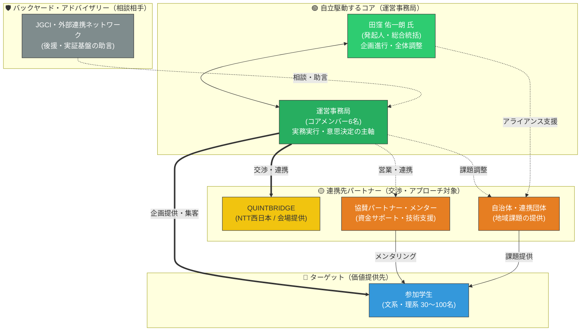
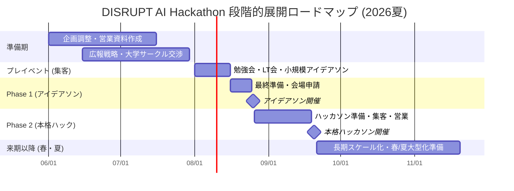
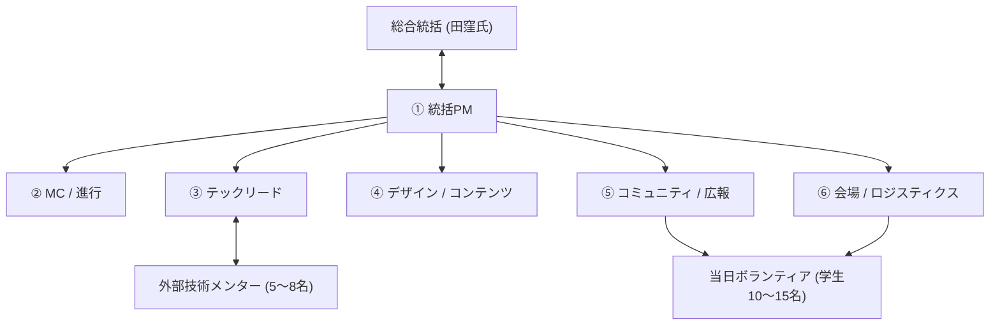

# 🚀 DISRUPT AI Hackathon (with KANSAI) — 段階的展開ロードマップ

> **正式イベント名**: DISRUPT AI Hackathon (with KANSAI)～Create Liberal＆Sciences～
> **会場**: QUINTBRIDGE（大阪・NTT西日本本社内）
> **運営主体**: DISRUPT AI Hackathon 運営事務局（コアメンバー6名）
> **発起人・総合統括**: 田窪 佑一朗 氏
> **後援・外部連携**: 一般社団法人 Japan Grand Challenge研究会（JGCI）/ 他、複数自治体および自治体連携団体（外部連携・アドバイザリーサポート枠）
> **ターゲット**: AI技術に興味関心のある学生（文系・理系問わず）
> **想定規模**: 参加者80名以上（Phase 3 フラグシップ開催時）
> **策定日**: 2026年5月26日

---

## ステークホルダーと開催体制（座組）

本ハッカソンを成功させるため、「自立的に駆動するコアメンバー」「大所高所から支えるバックヤード」「価値を提供するターゲット」の3層に分けてステークホルダーを整理します。
**外部の大人の支援（後援団体等）はあくまで「バックヤードの相談相手」に留め、イベントの実行・意思決定の全責任は運営事務局の6名が自立的に負います。**

### ステークホルダー相関図（自立運行型モデル）

### 各ステークホルダーの立ち位置とアクション

| 分類 | 関係者 | 立ち位置と今後のアクション |
| :--- | :--- | :--- |
| **🟢 味方** | **田窪 氏 / 運営事務局** | 企画の主体。実務と全体統括を担う、最も強固な自立型コアチーム。 |
| **🛡 バックヤード** | **JGCI・外部連携** | バックヤードアドバイザー。必要に応じた助言や、外部ネットワーク（企業・自治体）との窓口サポートを行う。 |
| **🟡 連携先** | **QUINTBRIDGE** | 会場の無償提供を取り付けるため、本企画の社会的意義（学生育成・地域共創・自立開発）を訴求する。 |
| **🟡 連携先** | **協賛パートナー** | 運営資金とメンターを確保するためのアプローチ先。若手への採用ブランディングや、AI活用アイデアの価値を提示する。 |
| **🟡 連携先** | **自治体** | 「リアルな地域課題」を提供してもらうための交渉先。特にPhase 3での連携を目指す。 |

---

## 企画コンセプト

> **「文系も参加しやすく、理系も物足りなさを感じないAIハッカソン」**

本イベントの核心は、学生がAIを単なるツールとして使うのではなく、**AIを活用したビジネス・社会実装・課題解決を真剣に考える場を提供すること**にあります。

単なる技術コンテストではなく、学生が社会課題・地域課題を自らリサーチし、AI・ノーコード技術を活用して社会実装可能なアイデアへ落とし込む**実践型イベント（アントレプレナーシップ教育）**として設計します。

### なぜ「文系・理系混合」なのか

AI時代の価値創出には、技術だけではなく、課題発見・ユーザー理解・企画設計・事業性・発信力が不可欠。ノーコードAIを活用することで技術経験の有無に関わらず参加でき、かつ審査でAI活用の妥当性・実装可能性・社会実装性まで評価することで、理系にとっても挑戦価値のあるイベントにします。

---

## ⚡️ 他のハッカソンとの圧倒的差別化（3大極大USP）

既存の「コードを書いて、順位をつけて終わり」のハッカソンとは一線を画す、独自の価値を提供します。

### 1. 成果物の寿命（Living Product）
* **従来**: 「提出して、審査されて終わり」の使い捨て。イベント翌日にはコードはゴミ箱行き。
* **本ハッカソン**: **「イベント後も、世界に向けて稼働し続ける」**。優秀なプロダクトは、事務局がその後のホスティングや運用支援を行い、実際に世にデプロイし続ける受け皿を用意します。

### 2. 評価とバトルのリアルさ（Live User Testing）
* **従来**: 「綺麗なスライドとピッチの一発芸アイデア」による審査。実用性は軽視されがち。
* **本ハッカソン**: **「実ユーザーの感情に直撃するテストローンチ」**。中間発表時にチーム同士が実際にアプリを使い合う「体験テストセッション」を設置。リアルなユーザーFBの獲得数も審査対象にします。

### 3. チーム結成の科学（0→1 Team Synergy）
* **従来**: 友達同士の内輪ウケ、または技術や熱量のミスマッチが起きやすい「適当な放置マッチング」。
* **本ハッカソン**: **「プロレベルの多職種（PM×エンジニア×デザイナー）マッチング」**。運営側が熱量と役割の相性を分析し、0→1開発で最もシナジーが出る混成チームを科学的に結成します。

---

## 📢 草の根コミュニティマーケティング（集客・広報戦略）

予算や大人の力に頼り切るのではなく、運営メンバー自身の行動によって確実に80名規模の参加者を集めるための、泥臭くもスマートなファネル設計です。

### 1. Connpass勉強会を起点とする「ミニ体験ハンズオン」の定期開催（ファネル設計）
いきなりハッカソンへの応募はハードルが高いため、6月・7月に「初心者大歓迎！Cursorで1時間でAIアプリを作る体験セミナー」などをConnpass等で無料開催。そこに参加した学生との関係性を築き、本戦ハッカソンへとコンバージョンさせます。

### 2. 大学・研究室・サークルへの「草の根アウトリーチ」
関西の主要大学の「AI・情報系研究室」や「ロボット・ITサークル」、および「起業・ビジネスサークル」に対し、運営メンバーがSNSのDMやゼミ生経由で直接アプローチ。地道な口コミ（バイラル）を発生させます。

### 3. コミュニティ内での「0→1 チーム結成ワークショップ」の実施
募集期間中に「1名での応募者」や「アイデアはあるがエンジニアがいない学生」を集めたオンラインミートアップを開催し、その場で仮チームを結成させてエントリーを促します。

---

## 本企画の「MUST（必須）」と「HOPE（希望）」

本プロジェクトを推進するにあたり、何があっても死守すべき最低ライン（MUST）と、理想的な大成功ライン（HOPE）を切り分けて整理します。

### 🔴 MUST（絶対に達成・死守すべきライン）
本ハッカソンの「存続と意義」に関わる必須要件です。
1. **開催規模**: Phase 1（アイデアソン）および Phase 2（50名規模ハッカソン）の確実な開催。
2. **参加者負担**: 学生の**参加費完全無料**の維持。
3. **会場**: QUINTBRIDGEの**無償利用枠**の獲得。
4. **資金確保**: 弁当代や必要最低限の運営費（約40〜50万円）を賄う協賛パートナーの獲得。
5. **提供価値**: 文系・理系問わず、ノーコード・生成AIを利用した「動くプロトタイプ」の実装成功体験の提供。

### 🌟 HOPE（達成できれば大成功となる理想ライン）
本企画の影響力を最大化し、次なる展開（法人化・文化創出）へと繋げるための希望要件です。
1. **開催規模**: Phase 3（80〜100名規模・3日間）の統合型フラグシップ開催。
2. **外部連携**: 複数自治体からの「公式後援」および「リアルな地域課題」の獲得。
3. **発展性**: イベントフォーマットのIP化、運営基盤の将来的な法人化（一般社団法人等）の実現。

---

## 全体タイムライン概観

> [!NOTE]
> 上記日程は目安です。QUINTBRIDGE の空き状況、大学の学事日程（試験期間の回避）を考慮して調整してください。Phase 1 を**夏休み前の7月**に設定することで、Phase 2 を**夏休み中の9月初旬**に実施しやすくなります。田窪氏および運営事務局メンバーでの定例ミーティングを週次で実施し、進捗管理を行います。

---

## Phase 1：AIアイデアソン＆ライトハッカソン（フックイベント・選抜機会）

### 🎯 目的と位置づけ

| 項目 | 内容 |
|------|------|
| **目的** | AI活用への心理的ハードルを下げ、「自分にもできる」という成功体験を提供する |
| **理系学生向け** | Phase 2（本格ハッカソン）への**出場権をかけた選抜機会** |
| **文系学生向け** | AI実装の成功体験を提供し、活用への心理的ハードルを払拭 |
| **想定参加者数** | 30〜40名（5名×6〜8チーム） |
| **開催形式** | ワンデイ（1日・約8時間） |
| **参加費** | 無料 |

### 📋 イベント設計

#### 使用ツール（参加者に事前案内）
生成AI（ChatGPT/Gemini/Claude）、ノーコード開発ツール（Dify/v0.dev/Bolt.new）、デザイン（Canva/Figma）、プレゼン（Google Slides等）。

#### 当日タイムテーブル（体験テストセッションの導入）

| 時間 | 内容 | 詳細 | 担当ロール |
|------|------|------|------------|
| 09:00–09:30 | 受付・開場 | 名札配布、Wi-Fi接続確認、座席案内 | ⑥ロジ / 当日スタッフ |
| 09:30–10:00 | **オープニング** | 企画趣旨説明、ルール・審査基準・当日の流れ説明。総合統括 田窪氏の挨拶 | ①統括PM / ②MC |
| 10:00–10:30 | **インプットセッション** | 社会課題の見つけ方、AI・ノーコード活用のハンズオン | ③テック |
| 10:30–11:00 | チームビルディング | 文系・理系が偏らない「0→1 Team Synergy」に基づくマッチング | ②MC / ⑤コミュニティ |
| 11:00–12:15 | **課題リサーチ & アイデア設計** | 社会課題を調査、背景・当事者・既存解決策を整理、AI活用の解決策を設計 | ③テック / メンター巡回 |
| 12:15–13:00 | ランチ交流会 | 軽食提供しながら参加者交流 | ⑥ロジ |
| 13:00–15:00 | **ライトハッカソン** | ノーコードAIでプロトタイプ実装 | ③テック / メンターサポート |
| 15:00–15:30 | **体験テストセッション (Live User Testing)** | 各チームが作成したプロトタイプを互いに触り合い、フィードバックカードを送り合う | 全員 / ②MC |
| 15:30–16:15 | プレゼン準備 | 体験テストでのFBをスライドに反映、発表準備 | ③テック / ⑤コミュニティ |
| 16:15–17:15 | **成果発表** | 各チーム5分発表 + 2分質疑 | ②MC / 審査員 |
| 17:15–17:45 | **審査・選出・表彰** | 優秀チームに**Phase 2 出場権を授与**。田窪氏ら審査員による総評 | ①統括PM / 田窪氏 / 審査員 |
| 17:45–18:15 | クロージング & 交流 | 総評、Phase 2 告知、写真撮影、アンケート | 全員 |

---

## Phase 2：本格ハッカソン

### 🎯 目的と位置づけ

| 項目 | 内容 |
|------|------|
| **目的** | 実践的な課題解決と実装力の育成。コーディングも視野に入れた本格開発 |
| **想定参加者数** | 50〜60名（5名×10〜12チーム） |
| **開催形式** | 2日間（土日） |
| **参加費** | 無料 |

### 📋 当日タイムテーブル（Day 2 抜粋・体験テストセッション）
Day 2 の発表前に、チーム間で実際にシステムを触り合う時間を設けます。

| 時間 | 内容 | 詳細 | 担当・体制 |
|------|------|------|------------|
| 11:30–12:00 | **体験テストセッション (Live User Testing)** | お互いのプロトタイプを実際に操作し、リアルなバグ報告やUI改善案を集約する | ②MC / ⑤コミュニティ |
| 12:00–12:45 | ランチ | 弁当提供 | ⑥ロジ |
| 12:45–13:30 | プレゼン準備 | テストフィードバックを反映したスライド仕上げ、動作デモリハーサル | ③テック / ⑤コミュニティ |
| 13:30–15:30 | **成果発表会** | 各チーム7分発表 + 3分質疑 | ②MC / 審査員 |
| 15:30–16:00 | 審査タイム | 審査員合議（田窪氏、協賛パートナー代表等） | ①統括PM / 審査員 |
| 16:00–16:30 | 結果発表・表彰式 | 各賞発表、**Phase 3 出場権授与** | ②MC / 田窪氏 / 審査員 |

---

## Phase 3：統合型イベント（アイデアソン × ハッカソン × ビジコン）

### 🎯 目的と位置づけ
* コンセプト→プロダクト→実ユーザー稼働までを一気通貫で体験するアントレプレナーシップ教育。
* **想定参加者数**: 80〜100名（5名×16〜20チーム）
* **開催形式**: 3日間

### 📋 Day 3：成果発表と実稼働評価（約7時間）

| 時間 | 内容 | 詳細 | 担当・体制 |
|------|------|------|------------|
| 09:30–10:00 | 受付・最終準備 | 開場、各チーム動作チェック | ⑥ロジ / 当日スタッフ |
| 10:00–11:30 | **プレゼン資料作成** | ピッチスライド作成、デモ動作環境の最終調整 | ④デザイン / ③テック |
| 11:30–12:15 | **実ユーザー体験会 (Live User Testing)** | 会場内に展示ブースを設置し、他の参加者や来場者が実際にシステムを触って評価する時間 | 全員 / ②MC |
| 12:15–13:00 | ランチ | 弁当提供 | ⑥ロジ |
| 13:00–13:45 | リハーサル・設営 | 観客席・審査員席の設営（80名＋一般観覧対応） | ⑥ロジ / 当日スタッフ15名 |
| 13:45–15:45 | **最終プレゼンテーション** | 各チーム8分発表 + 4分質疑。体験会での評価結果も一部審査に加味 | ②MC / 審査員 |
| 15:45–16:15 | 審査タイム | 審査員合議（田窪氏、パートナー企業代表等） | ①統括PM / 田窪氏 / 審査員 |
| 16:15–17:00 | **結果発表・表彰式** | 各賞発表、総評、**今後のデプロイ伴走チームの発表** | ②MC / 田窪氏 / 審査員 |
| 17:00–17:30 | クロージング | 集合写真、アンケート、今後の新組織展開告知 | 全員 / 当日スタッフ |

---

## 運営体制と役割分担（80名規模対応）

80名以上の参加者を6名のコア運営メンバーで安全かつ高品質に運営するため、**発起人・総合統括（田窪氏）**と強固な協力ラインを結び、さらに**「当日ボランティアスタッフ（学生10〜15名）」**を組織化して運営体制を拡張します。

### 運営組織図

### 運営メンバー（コア6名）の具体的責務

* **① 統括PM / プロデューサー**: 予算管理、全体スケジュール統括、緊急時の最終意思決定。田窪氏との進捗同期（週次）、パートナー交渉窓口。
* **② MC / ファシリテーター**: 当日の司会進行、アイスブレイク設計。
* **③ テックリード**: 技術環境の設計、外部技術メンターのシフト管理・ブリーフィング。
* **④ デザイン / コンテンツ**: イベントビジュアルのデザイン、記録撮影、Day 1のデザイン指導。
* **⑤ コミュニティ / 広報**: 参加者集客、大学・サークル交渉、当日ボランティア（10〜15名）の公募・採用統括。
* **⑥ 会場 / ロジスティクス**: QUINTBRIDGE担当者とのインフラ調整、ケータリング発注、ボランティアの会場シフト管理。

---

## 予算概算（80名規模対応）

80名以上の参加者と当日スタッフ、メンター等を含めた現実的な予算概算です。（※お金がないことを見せる表現は一切廃止し、スマートな運用費として算出）

| 項目 | Phase 1 | Phase 2 | Phase 3 |
|------|--------:|--------:|--------:|
| **会場費** | ¥0 | ¥0 | ¥0 |
| **飲食費**（お弁当・お茶・交流会費） | ¥70,000 | ¥250,000 | ¥550,000 |
| **広報・制作費**（フライヤー・ポスター・ステッカー） | ¥20,000 | ¥50,000 | ¥80,000 |
| **備品・消耗品**（電源ドラムレンタル・名札） | ¥15,000 | ¥30,000 | ¥50,000 |
| **賞品・景品**（Amazonギフトカード等） | ¥15,000 | ¥50,000 | ¥150,000 |
| **ゲスト・審査員謝礼・交通費** | — | ¥40,000 | ¥120,000 |
| **雑費・予備費** | ¥10,000 | ¥20,000 | ¥40,000 |
| **合計（税抜目安）** | **¥130,000〜** | **¥440,000〜** | **¥990,000〜** |

> [!NOTE]
> 会場である QUINTBRIDGE は、社会的意義（AI人材育成・地域活性化・学生共創）を評価いただくことで、会場使用料を無償でご提供いただくことを大前提として交渉を進めます。予算の大部分（特に飲食費と賞品代）は、獲得する「企業協賛金（スポンサーシップ）」を補填して相殺し、参加学生の完全無料を維持します。

---

## 継続展開の方向性

本イベントは単発で終わらせず、関西圏における継続的なAI人材育成と企業・自治体連携の仕組み（IP化・法人化）へ発展させることを見据えます。

```mermaid
graph LR
    P1["Phase 1<br/>初回実績づくり"] --> P2["Phase 2<br/>協賛モデル確立"]
    P2 --> P3["Phase 3<br/>関西最大級フラグシップ"]
    P3 --> F1["定期開催化<br/>(年2回開催)"]
    F1 --> F2["IP化・運営フォーマット確立"]
    F2 --> F3["企業AI実装・インターン接続"]
    F3 --> F4["運営基盤の法人化<br/>(一般社団法人等)"]

    style P1 fill:#E3F2FD,stroke:#2196F3
    style P2 fill:#E8F5E9,stroke:#4CAF50
    style P3 fill:#FFF3E0,stroke:#FF9800
    style F1 fill:#F3E5F5,stroke:#9C27B0
    style F2 fill:#FCE4EC,stroke:#E91E63
    style F3 fill:#FFF9C4,stroke:#FFC107
    style F4 fill:#E0F7FA,stroke:#00BCD4
```

| 展開段階 | 内容 |
|---------|------|
| **ハッカソンの継続開催** | 年2回（春・夏）の開催サイクルを確立し、関西圏の学生AI人材の登竜門としての地位を確立。 |
| **イベントフォーマットのIP化** | 審査基準、ワークシート、当日スライド、Discord運営設計をパッケージ化し、他地域でも開催可能なライセンスIPとして確立。 |
| **実践型インターン接続** | 優秀なアウトプットを見せたチームや個人を、協賛企業のAI実装プロジェクトや新規事業開発インターンシップへ直接紹介。 |
| **運営基盤の法人化** | 継続的な協賛金受け入れ、自治体との公式契約、知的財産（IP）管理を円滑に行うため、将来的な「一般社団法人」などの法人格取得を視野に入れる。 |

---

## 👥 運営管理・コミュニケーションルール

### 1. 各班の定例ミーティング日程（固定）
毎週以下のスケジュールで定期MTGを実施し、進捗の同期とタスク進行を行います。
* **広報班**：毎週火曜日 23:00 〜 24:00
* **外部連携班**：毎週木曜日 22:00 〜 23:00
* **企画進行班**：毎週土曜日 22:00 〜 23:00
* 次の全体定例までに、各班で最低1回は定例MTGを開催すること。

### 2. Discordコミュニケーションルール
* チャンネル内のログが流れて情報を見失うのを防ぐため、同一トピック内のやり取りは**必ず「スレッド」を使用して返信**することをルール化します。

### 3. 全メンバー共通の直近ToDo
* **Googleカレンダーの登録**: 共有された全体スケジュール用のカレンダー（.ics/iCal形式）を各自速やかに登録。
* **HP掲載用メンバー紹介文の提出【今日中締切】**: お名前（ニックネーム可）と軽い自己紹介（かっこいい2つ名など）をDiscordの指定チャンネルに送信。

## 次のアクション（直近2週間のタスク）

| 優先度 | タスク | 担当 | 期限目安 |
| :---: | :--- | :--- | :--- |
| 🔴 | **QUINTBRIDGE への会場無償利用の打診・日程仮押さえ** | ①統括PM + 田窪氏 | 今週中 |
| 🔴 | **協賛・パートナー企業開拓の開始（協賛提案書・メニューの確定）** | ①統括PM + 田窪氏 | 今週中 |
| 🔴 | **Phase 1（8月開催予定）の開催日確定（テスト期間等の学事日程回避）** | 全員（定例） | 今週中 |
| 🟡 | **イベントコンセプト・告知LP構成案の確定** | ④デザイン + ⑤コミュニティ | 来週中 |
| 🟡 | **第1次予算計画書および協賛メニュー提案書の最終化** | ①統括PM + 田窪氏 | 来週中 |
| 🟢 | **Discordコミュニティの開設および動作検証** | ⑤コミュニティ + ③テックリード | 2週間以内 |
| 🟢 | **当日ボランティア学生スタッフの募集要項ドラフト作成** | ⑤コミュニティ + ⑥ロジ | 2週間以内 |
