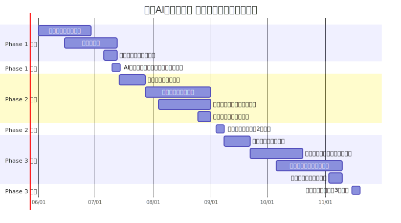

# 🚀 DISRUPT AI Hackathon 2026 — 段階的展開ロードマップ

> **正式イベント名**: DISRUPT AI Hackathon 2026（）
> **会場**: QUINTBRIDGE（大阪・NTT西日本本社内）
> **運営主体**: DISRUPT AI Hackathon 2026 運営事務局（コアメンバー6名）
> **発起人・総合統括**: 田窪 佑一朗 氏
> **後援・外部連携**: 本多 竜之介 氏（JGCI アドバイザー） ｜ 一般社団法人 Japan Grand Challenge研究会（JGCI） / 他、複数自治体および自治体連携団体
> **ターゲット**: AI技術に興味関心のある学生（文系・理系問わず）
> **想定規模**: 参加者80名以上（Phase 3 フラグシップ開催時）
> **策定日**: 2026年5月26日

---

## ステークホルダーと開催体制（座組）

本ハッカソンを成功させるため、「すでに味方として連携しているコアメンバー」「今後説得・巻き込みが必要なパートナー」「価値を提供するターゲット」の3層に分けてステークホルダーを整理します。

### ステークホルダー相関図（誰が味方か）

### 各ステークホルダーの立ち位置とアクション

| 分類 | 関係者 | 立ち位置と今後のアクション |
| :--- | :--- | :--- |
| **🟢 味方** | **田窪 氏 / 運営事務局** | 企画の主体。実務と全体統括を担う、最も強固なコアチーム。 |
| **🟢 味方** | **本多 氏 / JGCI** | 強力な後援者。外部ネットワーク（企業・自治体）との接続役であり、社会実装のリアリティを担保する。 |
| **🟡 説得対象** | **QUINTBRIDGE** | **【最重要説得対象】** 会場の無償提供を取り付けるため、本企画の社会的意義（学生育成・地域共創）を訴求する。 |
| **🟡 説得対象** | **協賛企業** | 運営資金とメンターを確保するための営業先。採用ブランディングや若手アイデア獲得のメリットを提示する。 |
| **🟡 説得対象** | **自治体** | 「リアルな社会課題」を提供してもらうための交渉先。特にPhase 3での連携を目指す。 |

---

## 企画コンセプト

> **「文系も参加しやすく、理系も物足りなさを感じないAIハッカソン」**

本イベントの核心は、学生がAIを単なるツールとして使うのではなく、**AIを活用したビジネス・社会実装・課題解決を真剣に考える場を提供すること**にあります。

単なる技術コンテストではなく、学生が社会課題・地域課題を自らリサーチし、AI・ノーコード技術を活用して社会実装可能なアイデアへ落とし込む**実践型イベント（アントレプレナーシップ教育）**として設計します。

### なぜ「文系・理系混合」なのか

AI時代の価値創出には、技術だけではなく、課題発見・ユーザー理解・企画設計・事業性・発信力が不可欠。ノーコードAIを活用することで技術経験の有無に関わらず参加でき、かつ審査でAI活用の妥当性・実装可能性・社会実装性まで評価することで、理系にとっても挑戦価値のあるイベントにします。

| 文系学生が担える役割 | 理系学生が担える役割 | 共通で担える役割 |
|---------------------|---------------------|-----------------|
| 社会課題リサーチ | AI活用設計 | 課題定義 |
| 地域課題リサーチ | ノーコード実装 | 解決策設計 |
| ユーザー理解 | プロトタイプ構築 | チーム内意思決定 |
| 企画設計 | データ活用 | 発表準備 |
| ビジネスモデル検討 | 技術検証 | 社会実装可能性の検討 |
| 発表構成・ストーリー設計 | 実装可能性の検討 | |
| 企業・自治体向け説明 | ツール選定 | |

---

## 本企画の「MUST（必須）」と「HOPE（希望）」

本プロジェクトを推進するにあたり、何があっても死守すべき最低ライン（MUST）と、理想的な大成功ライン（HOPE）を切り分けて整理します。これにより、運営チーム内での意思決定基準を明確にします。

### 🔴 MUST（絶対に達成・死守すべきライン）
本ハッカソンの「存続と意義」に関わる必須要件です。
1. **開催規模**: Phase 1（アイデアソン）および Phase 2（50名規模ハッカソン）の確実な開催。
2. **参加者負担**: 学生の**参加費完全無料**の維持。
3. **会場**: QUINTBRIDGEの**無償利用枠**の獲得（または代替無料会場の確保）。
4. **資金確保**: 弁当代・交通費など、最低限の運営費（約40〜50万円）を賄う小〜中規模スポンサーの獲得。
5. **提供価値**: 文系・理系問わず、ノーコード・生成AIを利用した「動くプロトタイプ」の実装成功体験の提供。

### 🌟 HOPE（達成できれば大成功となる理想ライン）
本企画の影響力を最大化し、次なる展開（事業化・法人化等）へと繋げるための希望要件です。
1. **開催規模**: Phase 3（80〜100名規模・3日間合宿形式）の統合型フラグシップ開催。
2. **外部連携**: 複数自治体からの「公式後援」および「リアルな地域課題」の獲得。
3. **高額資金**: ゴールドスポンサー（20万円クラス）の複数社獲得による、豪華な賞品提供やリッチな演出の実現。
4. **発展性**: イベントフォーマットのIP化、優秀チームの協賛企業インターンシップ直結、将来的な法人化（一般社団法人等）の実現。

---

## 全体タイムライン概観

> [!NOTE]
> 上記日程は目安です。QUINTBRIDGE の空き状況、大学の学事日程（試験期間の回避）を考慮して調整してください。Phase 1 を**夏休み前の7月**に設定することで、Phase 2 を**夏休み中の9月初旬**に実施しやすくなります。田窪氏および本多氏との定例ミーティングを週次で実施し、進捗管理を行います。

---

## Phase 1：AIアイデアソン＆ライトハッカソン（フックイベント・選抜機会）

### 🎯 目的と位置づけ

| 項目 | 内容 |
|------|------|
| **目的** | AI活用への心理的ハードルを下げ、「自分にもできる」という成功体験を提供する |
| **理系学生向け** | Phase 2（本格ハッカソン）への**出場権をかけた選抜機会** |
| **文系学生向け** | AI実装の成功体験を提供し、活用への心理的ハードルを払拭 |
| **訴求メッセージ** | **「社会課題を見つけ、AIで実装し、次の本格ハッカソンへ。」** |
| **想定参加者数** | 30〜40名（5名×6〜8チーム） |
| **開催形式** | ワンデイ（1日・約8時間） |
| **参加費** | 無料 |

> [!IMPORTANT]
> Phase 1 は単なる入門イベントではありません。**優秀チームには Phase 2（本格ハッカソン）への出場権を授与**することで、理系学生にとって明確な目標設定を行い、モチベーションを最大化します。文系学生には「アイデアを実装できる」という成功体験を提供します。

### 📋 イベント設計

#### テーマ
社会課題・地域課題を自ら見つけ、AI・ノーコード技術を活用して社会実装アイデアへ落とし込む

> [!TIP]
> 社会課題は多岐分野にわたりますが、あらゆる分野でAIは活用できます。学生にどの分野でもAIは活用できる、ということを実感していただける設計にします。

#### 使用ツール（参加者に事前案内）

| カテゴリ | ツール例 | 用途 |
|----------|----------|------|
| 生成AI | ChatGPT / Gemini / Claude | アイデア壁打ち・コンテンツ生成 |
| ノーコード開発 | Dify / v0.dev / Bolt.new | AIアプリのプロトタイピング |
| デザイン | Canva / Figma | UI/UXモックアップ |
| プレゼン | Google Slides / Gamma | 成果発表スライド |

#### 当日タイムテーブル

| 時間 | 内容 | 詳細 | 担当ロール |
|------|------|------|------------|
| 09:00–09:30 | 受付・開場 | 名札配布、Wi-Fi接続確認、座席案内 | ⑥ロジ / 当日スタッフ |
| 09:30–10:00 | **オープニング** | 企画趣旨説明、ルール・審査基準・当日の流れ説明。総合統括 田窪氏の挨拶 | ①統括PM / ②MC |
| 10:00–10:30 | **企業セッション** | 現場でのAI活用事例の紹介（本多氏のネットワークによる協賛企業登壇） | ②MC / 本多氏 |
| 10:30–11:00 | **インプットセッション** | 社会課題の見つけ方、AI・ノーコード活用のハンズオン | ③テック |
| 11:00–11:15 | チームビルディング | 文系・理系・企画・技術が偏らないチーム構成、アイスブレイク | ②MC / ⑤コミュニティ |
| 11:15–12:15 | **課題リサーチ & アイデア設計** | 社会課題を調査、背景・当事者・既存解決策を整理、AI活用の解決策を設計 | ③テック / メンター巡回 |
| 12:15–13:00 | ランチ交流会 | 軽食提供しながら参加者交流 | ⑥ロジ |
| 13:00–15:30 | **ライトハッカソン** | ノーコードAIでプロトタイプ実装 | ③テック / メンターサポート |
| 15:00 | 中間チェック | 各チーム1分で進捗共有 | ②MC |
| 15:30–16:15 | プレゼン準備 | スライド作成・デモリハーサル | ③テック / ⑤コミュニティ |
| 16:15–17:15 | **成果発表** | 各チーム5分発表 + 2分質疑 | ②MC / 審査員 |
| 17:15–17:45 | **審査・選出・表彰** | 優秀チームに**Phase 2 出場権を授与**。本多氏・田窪氏による総評 | ①統括PM / 本多氏 / 田窪氏 |
| 17:45–18:15 | クロージング & 交流 | 総評、Phase 2 告知、写真撮影、アンケート | 全員 |

#### 審査基準（Phase 1）

| 基準 | 配点 | 説明 |
|------|------|------|
| 社会課題の発見力 | 20% | 誰の、どのような課題を解決するのかが明確か |
| リサーチの深さ | 15% | 課題の背景、当事者、既存解決策が整理されているか |
| AI活用の妥当性 | 20% | AIを使う理由が明確で、課題解決に接続しているか |
| ノーコード実装の完成度 | 20% | 動く、見える、説明できる状態になっているか |
| アイデアの独自性 | 10% | 着眼点のユニークさ |
| 発表の説得力 | 10% | 課題→解決策→実装→効果が一貫しているか |
| Phase 2 への伸びしろ | 5% | 本格ハッカソンでの発展可能性 |

---

## Phase 2：本格ハッカソン

### 🎯 目的と位置づけ

| 項目 | 内容 |
|------|------|
| **目的** | 実践的な課題解決と実装力の育成。コーディングを伴う本格開発 |
| **位置づけ** | Phase 1 優秀チームの出場権行使 + 新規の技術志向学生の取り込み |
| **想定参加者数** | 50〜60名（5名×10〜12チーム） |
| **開催形式** | 2日間（土日） |
| **参加費** | 無料（スポンサーシップで賄う） |

### 📋 イベント設計

#### テーマ例
- 「AIで地域の社会課題を解決せよ」（QUINTBRIDGE / NTT西日本との親和性。複数自治体・地域団体連携）
- 「生成AI × ○○ で未来のサービスを創れ」

#### 当日タイムテーブル（Day 1）

| 時間 | 内容 | 詳細 | 担当・体制 |
|------|------|------|------------|
| 09:30–10:00 | 受付・開場 | 参加者チェックイン、Discord案内 | ⑥ロジ / 当日スタッフ5名 |
| 10:00–10:30 | オープニング | 主催挨拶、テーマ発表、田窪氏・本多氏によるスポンサー紹介 | ①統括PM / ②MC |
| 10:30–11:00 | キーノートスピーチ | ゲストによるインスピレーショントーク（JGCI関係者 or 企業エンジニア） | 本多氏 / ②MC |
| 11:00–11:30 | チームビルディング | 事前アンケートに基づくチーム編成、アイスブレイク | ②MC / ⑤コミュニティ |
| 11:30–12:30 | 課題リサーチ & アイデア設計 | 社会課題の調査→コンセプト決定 | ③テック / メンター巡回 |
| 12:30–13:15 | ランチ | 弁当提供 | ⑥ロジ |
| 13:15–18:00 | **ハックタイム①** | 設計→実装（メンター巡回サポート） | ③テック / メンター5名 |
| 15:00 | 中間メンタリング | AI技術・ビジネス・社会実装視点からフィードバック | メンター陣 / 本多氏 |
| 18:00–18:30 | 進捗共有（Lightning Talk） | 各チーム1分で進捗を全体共有 | ②MC |
| 18:30–19:30 | 夕食交流会 | ピザ等のケータリング交流会 | ⑥ロジ / 当日スタッフ5名 |
| 19:30–21:00 | **ハックタイム②（任意）** | 希望者のみ残って開発継続 | ③テック（見守り） |

#### 当日タイムテーブル（Day 2）

| 時間 | 内容 | 詳細 | 担当・体制 |
|------|------|------|------------|
| 09:00–09:30 | 受付・開場 | 朝食・コーヒー提供 | ⑥ロジ / 当日スタッフ |
| 09:30–12:00 | **ハックタイム③** | 実装仕上げ・デモ準備 | ③テック / メンター |
| 10:30 | 最終メンタリング | 技術 + プレゼン + 社会実装可能性の最終チェック | メンター陣 / 本多氏 |
| 12:00–12:45 | ランチ | 弁当提供 | ⑥ロジ |
| 12:45–13:30 | プレゼン準備 | デモリハーサル・スライド仕上げ | ③テック / ⑤コミュニティ |
| 13:30–15:30 | **成果発表会** | 各チーム7分発表 + 3分質疑 | ②MC / 審査員 |
| 15:30–16:00 | 審査タイム | 審査員合議（田窪氏、本多氏、協賛企業代表等） | ①統括PM / 審査員 |
| 16:00–16:30 | 結果発表・表彰式 | 各賞発表、**Phase 3 出場権授与** | ②MC / 田窪氏 / 本多氏 |
| 16:30–17:00 | クロージング & ネットワーキング | 総評、Phase 3 告知、集合写真 | 全員 |

---

## Phase 3：統合型イベント（アイデアソン × ハッカソン × ビジコン）

### 🎯 目的と位置づけ

| 項目 | 内容 |
|------|------|
| **目的** | コンセプト→プロダクト→ビジネスまでを一気通貫で体験するアントレプレナーシップ教育 |
| **位置づけ** | フラグシップイベント。コミュニティの集大成であり、関西最大級の発信力を持つ |
| **想定参加者数** | 80〜100名（5名×16〜20チーム） |
| **開催形式** | 3日間（合宿または通い形式） |
| **参加費** | 無料（スポンサーシップ + 自治体連携で賄う） |

### 📋 イベント設計

#### テーマ例
- 「2030年の大阪を、AIでアップデートせよ」（大阪関西万博を見据えた地域共創テーマ）
- 「AI × SDGs：持続可能な社会のための新サービスを創れ」
- 自治体（大阪府・大阪市・その他連携市町村）から提供される実課題テーマ

### Day 1：アイデアソン — 課題発見とデザイン（約8時間）

| 時間 | 内容 | 詳細 | 担当・体制 |
|------|------|------|------------|
| 09:30–10:00 | 受付・開場 | QRコードチェックイン、パンフレット配布 | ⑥ロジ / 当日スタッフ10名 |
| 10:00–10:45 | オープニングセレモニー | 主催挨拶、田窪氏・本多氏による来賓挨拶（NTT西日本・自治体関係者等） | ①統括PM / ②MC / 田窪氏 |
| 10:45–11:30 | 基調講演 | 起業家 or 社会起業家によるインスピレーショントーク | 本多氏（JGCI経由招聘） |
| 11:30–12:00 | 社会課題インプット | 自治体・企業から提供される実課題を含む3〜4つの課題領域を提示 | 本多氏 / 自治体担当者 |
| 12:00–12:45 | ランチ | 弁当提供、チーム内アイスブレイク | ⑥ロジ / 当日スタッフ |
| 12:45–13:15 | チームビルディング | 文系・理系・スキルベースのチーム編成（事前調整済） | ②MC / ⑤コミュニティ |
| 13:15–14:30 | **課題深掘りワーク** | ペルソナ設定、ユーザーストーリーマッピング、課題の構造化 | ⑤コミュニティ / メンター |
| 14:30–14:45 | 休憩 | | |
| 14:45–16:00 | **ソリューション設計** | AI活用の解決策設計、コンセプト決定 | ③テック / メンター巡回 |
| 16:00–17:30 | **UIデザイン** | Figma / Canva でワイヤーフレーム→UIモックアップ作成 | ④デザイン / メンターサポート |
| 17:30–18:15 | Day 1 成果発表 | 各チーム3分で課題定義 + UIデザインを発表 | ②MC |
| 18:15–18:30 | Day 1 採点・フィードバック | メンター・審査員からコメント（Day 1の中間配点） | 審査員 / 田窪氏 |
| 18:30–19:00 | クロージング & 交流 | | 全員 |

### Day 2：ハッカソン — プロトタイプ開発とビジネス検討（約9時間）

> **設計思想**: 最初の1時間で「動くもの」を作り、残りの時間を**プロダクト落とし込み（7割）**と**ビジネス展開検討（3割）**に充てます。

| 時間 | 内容 | 詳細 | 配分 |
|------|------|------|------|
| 09:30–10:00 | Day 1 振り返り & Day 2 説明 | | — |
| 10:00–11:00 | **クイックプロトタイプ実装** | コア機能の動作プロトタイプを最速で作る | 🔵 実装集中 |
| 11:00–12:30 | **プロダクト深化①** | 機能追加・改善、UX改善 | 🔵 プロダクト 7割 |
| 12:30–13:15 | ランチ | 弁当提供 | — |
| 13:15–14:15 | **ビジネスモデル検討** | ビジネスモデルキャンバス、収益モデル、市場規模推定 | 🟠 ビジネス 3割 |
| 14:15–15:45 | **プロダクト深化②** | ビジネス視点を踏まえたプロダクト改善、技術検証 | 🔵 プロダクト 7割 |
| 15:45–16:00 | 休憩 | スイーツ・お菓子配布（ロジ） | — |
| 16:00–17:00 | **ビジネス×プロダクト統合** | ユーザー獲得戦略、差別化ポイント、Go-to-Market | 🟠 ビジネス 3割 |
| 17:00–18:00 | **最終統合・仕上げ** | デモ動線確認、完成度向上 | 🔵 プロダクト 7割 |
| 18:00–18:30 | Day 2 クロージング | 明日へのモチベーション向上声かけ | — |

### Day 3：ビジコン — プレゼン準備と成果発表（約7時間）

| 時間 | 内容 | 詳細 | 担当・体制 |
|------|------|------|------------|
| 09:30–10:00 | 受付・最終準備 | 開場、各チーム動作チェック | ⑥ロジ / 当日スタッフ |
| 10:00–12:00 | **プレゼン資料作成** | ピッチスライド作成、デモ動画撮影、発表練習 | ④デザイン / ③テック / メンター |
| 12:00–12:45 | ランチ | | |
| 12:45–13:30 | **プレゼンリハーサル** | メンターによるリハーサルフィードバック | メンター陣 / ②MC |
| 13:30–13:45 | 休憩・会場セッティング | 観客席・審査員席の設営（80名＋一般観覧対応） | ⑥ロジ / 当日スタッフ15名 |
| 13:45–15:45 | **最終プレゼンテーション** | 各チーム8分発表 + 4分質疑（審査員4〜5名） | ②MC / 審査員 |
| 15:45–16:15 | 審査タイム | 審査員合議（参加者はネットワーキング交流会） | ①統括PM / 田窪氏 / 本多氏 |
| 16:15–17:00 | **結果発表・表彰式** | 各賞発表（自治体賞、企業協賛賞、最優秀賞等）、総評 | ②MC / 田窪氏 / 本多氏 |
| 17:00–17:30 | クロージング | 集合写真、アンケート、今後の展開告知 | 全員 / 当日スタッフ |

---

## 運営体制と役割分担（80名規模対応）

80名以上の参加者を6名のコア運営メンバーで安全かつ高品質に運営するため、**発起人・総合統括（田窪氏）**および**外部連携（本多氏）**と強固な協力ラインを結び、さらに**「当日ボランティアスタッフ（学生10〜15名）」**を組織化して運営体制を拡張します。

### 運営組織図

### 運営メンバー（コア6名）の具体的責務

#### ① 統括PM / プロデューサー
- **全体責務**: 予算管理、全体スケジュール統括、緊急時の最終意思決定。
- **外部連携**: 総合統括の田窪氏との進捗同期（週次）、外部連携の本多氏との協賛交渉・進捗調整。
- **当日役割**: 運営本部の指揮、タイムテーブル遅延時の調整、審査の取りまとめ。

#### ② MC / ファシリテーター
- **全体責務**: 当日の司会進行、アイスブレイク設計、ワークショップのファシリテーション。
- **資料連携**: デザイン担当と連携したスライド構成、本多氏と連携した企業紹介プログラムの進行。
- **当日役割**: タイムキーパーと連携したスムーズな進行、会場の熱量コントロール。

#### ③ テックリード
- **全体責務**: 技術環境（Wi-Fi、電源、APIキー配布）の設計、事前ハンズオンの設計。
- **外部連携**: 本多氏の紹介による協賛企業メンター（5〜8名）への技術ブリーフィング、メンターシフト管理。
- **当日役割**: 技術トラブル対応、デモ動作環境のサポート、技術メンタリングの統括。

#### ④ デザイン / コンテンツ
- **全体責務**: イベントのビジュアルアイデンティティ（ロゴ、スライド、看板等）のデザイン。
- **当日役割**: 記録写真・動画のリアルタイム撮影、SNS投稿用画像編集、Day 1のデザイン指導。

#### ⑤ コミュニティ / 広報
- **全体責務**: 参加者集客、大学・サークル営業、Discordコミュニティ運営。
- **体制拡張**: **当日ボランティアスタッフ（学生10〜15名）の公募・採用・事前レクチャー**の統括。
- **当日役割**: 受付デスクの統括、当日ボランティアへのタスク指示（チーム担当アサイン）。

#### ⑥ 会場 / ロジスティクス
- **全体責務**: QUINTBRIDGE担当者とのレイアウト・インフラ調整、備品・ケータリング発注。
- **体制拡張**: **当日ボランティアスタッフの会場シフト管理（受付、ゴミ回収、配膳、誘導等）**の統括。
- **当日役割**: 会場セッティング・撤収指揮、ケータリング配膳管理、インフラ（電源ドラム等）監視。

---

## 80名規模対応の当日の運営オペレーション設計

### 1. 体制補強（当日ボランティア・企業メンター体制）
- **当日スタッフ体制**: 80名以上の参加者が集まると、受付、弁当配布、会場誘導、ゴミ回収などの物理的作業が劇的に増加します。これをコア6名でこなすとハッカソンの品質管理（メンタリングや進行）が破綻するため、**学生ボランティア10〜15名を公募・配置**します。
- **協賛企業メンターの活用**: 16〜20チームが同時開発を行うため、運営側のテックリード1名では質問対応が不可能です。**協賛企業から技術・ビジネスメンターを計5〜8名招致**し、メンタリングシフト表を作成して各チームを漏れなく定期巡回する体制を構築します。

### 2. デジタル化による進行の効率化
- **QRコード受付**: 事前にGoogleフォーム等で発行したQRコードをスマホで提示してもらい、受付スピードを3倍化。
- **Discord / LINEのフル活用**: 会場での全体アナウンスは聞こえづらいため、運営からのお知らせ（タイムテーブル変更、お弁当配布開始等）はDiscordの特定チャンネルへのメンション配信で一斉周知します。
- **デモ事前チェックシート**: 発表直前の接続トラブル（画面が映らない、音が鳴らない）を防止するため、Day 3の昼に全チームにデモ確認用ディスプレイへ接続させ、動作確認を義務化します。

### 3. 常時メンタリングとレスキュー制度
- **定期巡回メンタリング**: メンター陣には各チーム最低1日3回（午前、午後、夕方）の巡回を義務付け、進行状況を「開発中」「詰まり中」「コンセプト迷走中」の3段階でスプレッドシート等にリアルタイム記録。
- **レッドカード（レスキュー）制度**: 各チームのテーブルに「赤色のカード」を配置。これを立てているチームには、テックリードまたはビジネスメンターが即座に駆けつけるオペレーションを導入します。

---

## 企業・自治体連携と協賛設計

本ハッカソンは、学生のアイデアを「ただのイベント成果」で終わらせず、社会実装に繋げることを目的とします。この産官学連携の設計は、**本多氏（JGCIアドバイザー）のネットワーク**および**JGCIの検証・可視化プラットフォーム**を活用して推進します。

### 協賛メニュー

| メニュー | ゴールド | シルバー | ブロンズ |
|----------|:-------:|:-------:|:-------:|
| **協賛金額（目安）** | ¥200,000 | ¥100,000 | ¥50,000 |
| **ロゴ掲載（LP・当日資料）** | ✅ 特大 | ✅ 中 | ✅ 小 |
| **当日の企業紹介セッション** | ✅ 5分 | ✅ 2分 | — |
| **企業冠賞（企業賞）の設置** | ✅ | ✅ | — |
| **審査員・メンターの派遣** | ✅ 2名まで | ✅ 1名まで | — |
| **企業課題テーマの提供** | ✅ | — | — |
| **参加学生へのアプローチ** | ✅ 優先 | ✅ | ✅ |

### 企業・自治体に提供する価値

- **企業**: 次世代AI人材（文理共創型）への早期接触、採用広報、若手視点のAI活用アイデアの獲得、社会貢献・ESG文脈。
- **自治体・自治体連携団体**: 地域課題に対する「AI×学生視点」の現実的な解決プロトタイプの獲得、若手人材の地域活性化への巻き込み。
- **教育機関**: 学生に対する最先端のアントレプレナーシップ・社会実装型教育の実践機会。

---

## KPI（重要業績評価指標）

80名規模前提に基づき、各フェーズの目標数値を再設定します。

| KPI | Phase 1 目標 | Phase 2 目標 | Phase 3 目標 |
|-----|:----------:|:----------:|:----------:|
| **参加者数（実動員）** | 30〜40名 | 50〜60名 | 80〜100名 |
| **文系学生の参加比率** | 30%以上 | 30%以上 | 35%以上 |
| **当日運営ボランティアスタッフ数** | 2〜3名 | 5〜8名 | 10〜15名 |
| **協賛企業メンター数** | 2名以上 | 4名以上 | 6名以上 |
| **参加者満足度（NPS）** | 50以上 | 60以上 | 70以上 |
| **「次回も参加したい」回答率** | 70%以上 | 75%以上 | 80%以上 |
| **全チームがデモ成果物を発表** | 80%以上 | 90%以上 | 95%以上 |
| **獲得協賛企業数** | — | 3社以上 | 5社以上 |
| **SNS投稿数（#ハッシュタグ）** | 50件以上 | 120件以上 | 250件以上 |
| **メディア掲載実績** | — | 2件以上 | 5件以上 |

---

## リスク管理

80名規模を6名のコアメンバーで運営するにあたり、想定される高リスクと具体的な回避策を定義します。

| リスク | 発生確率 | 影響度 | 対策 |
|--------|:--------:|:------:|------|
| **80名規模におけるコア6名のキャパシティ限界** | 極めて高 | 極めて高 | ・総合統括の田窪氏と緊密に連携し、実務タスクの一部を当日ボランティア（10〜15名）へ委譲。 ・本多氏の紹介による協賛企業メンターを招致し、テーブルメンタリングの負荷を分散。 |
| **Wi-Fi / 電源インフラのダウン** | 中 | 極めて高 | ・QUINTBRIDGE担当者と事前に80人同時接続テストを実施。 ・電源ドラムを1チームあたり最低1個（合計20個以上）手配。 ・運営用バックアップとしてモバイルWi-Fiを3台常備。 |
| **文系・理系チーム間での衝突** | 中 | 中 | ・チームビルディング時に「文理共創カード」を配布し、互いの役割（ビジネス側・技術側）を定義。 ・メンターが巡回し、特定のメンバー（理系のみ、文系のみ）にタスクが偏っていないかを常時チェック。 |
| **キャンセルによる参加者急減** | 高 | 中 | ・定員の1.2倍（Phase 3なら120名程度）を目標に募集し、キャンセル待ち枠を設定。 ・Discord等でリマインドを1週間前、3日前に徹底送信。 |
| **予算不足・キャッシュフロー悪化** | 低 | 高 | ・本多氏・JGCIのネットワークを通じた協賛企業開拓をPhase 2準備期（W-8）から本格化。 ・支出の大きい飲食費は、協賛獲得状況に応じてグレード調整可能なメニューで発注。 |

---

## 予算概算（80名規模対応）

80名以上の参加者と当日スタッフ、メンター等を含めた現実的な予算概算です。

| 項目 | Phase 1 | Phase 2 | Phase 3 |
|------|--------:|--------:|--------:|
| **会場費** | ¥0 | ¥0 | ¥0 |
| **飲食費**（お弁当・お茶・交流会費） | ¥70,000 | ¥250,000 | ¥550,000 |
| **広報費**（SNS広告・印刷物・チラシ） | ¥20,000 | ¥50,000 | ¥80,000 |
| **備品・消耗品**（電源ドラムレンタル・名札） | ¥15,000 | ¥30,000 | ¥50,000 |
| **賞品・景品**（Amazonギフトカード等） | ¥15,000 | ¥50,000 | ¥150,000 |
| **ゲスト・審査員謝礼・交通費** | — | ¥40,000 | ¥120,000 |
| **雑費・予備費** | ¥10,000 | ¥20,000 | ¥40,000 |
| **合計（税抜目安）** | **¥130,000〜** | **¥440,000〜** | **¥990,000〜** |

> [!NOTE]
> 会場である QUINTBRIDGE は、社会的意義（AI人材育成・地域活性化・学生共創）を評価いただくことで、会場使用料を無償でご提供いただくことを大前提として交渉を進めます。予算の大部分（特に飲食費と賞品代）は、本多氏とJGCIの連携支援によって獲得する「企業協賛金（スポンサーシップ）」を補填して相殺し、参加学生の完全無料を維持します。

---

## 継続展開の方向性

本イベントは単発で終わらせず、関西圏における継続的なAI人材育成と企業・自治体連携の仕組み（IP化・法人化）へ発展させることを見据えます。

| 展開段階 | 内容 |
|---------|------|
| **ハッカソンの継続開催** | 年2回（春・夏）の開催サイクルを確立し、関西圏の学生AI人材の登竜門としての地位を確立。 |
| **イベントフォーマットのIP化** | 審査基準、ワークシート、当日スライド、Discord運営設計をパッケージ化し、他地域でも開催可能なライセンスIPとして確立。 |
| **実践型インターン接続** | 優秀なアウトプットを見せたチームや個人を、協賛企業のAI実装プロジェクトや新規事業開発インターンシップへ直接紹介。 |
| **運営基盤の法人化** | 継続的な協賛金受け入れ、自治体との公式契約、知的財産（IP）管理を円滑に行うため、将来的な「一般社団法人」などの法人格取得を視野に入れる。 |

---

## 次のアクション（直近2週間のタスク）

| 優先度 | タスク | 担当 | 期限目安 |
|:------:|--------|------|----------|
| 🔴 | **QUINTBRIDGE への会場無償利用の打診・日程仮押さえ** | ①統括PM + 田窪氏 | 今週中 |
| 🔴 | **本多氏およびJGCIとのキックオフミーティング（協賛開拓リストの作成開始）** | ①統括PM + 田窪氏 + 本多氏 | 今週中 |
| 🔴 | **Phase 1（7月開催予定）の開催日確定（テスト期間等の学事日程回避）** | 全員（定例） | 今週中 |
| 🟡 | **イベントコンセプト・告知LP構成案の確定** | ④デザイン + ⑤コミュニティ | 来週中 |
| 🟡 | **第1次予算計画書および協賛メニュー提案書の作成** | ①統括PM + 田窪氏 | 来週中 |
| 🟢 | **Discordコミュニティの開設および動作検証** | ⑤コミュニティ + ③テックリード | 2週間以内 |
| 🟢 | **当日ボランティア学生スタッフの募集要項ドラフト作成** | ⑤コミュニティ + ⑥ロジ | 2週間以内 |
