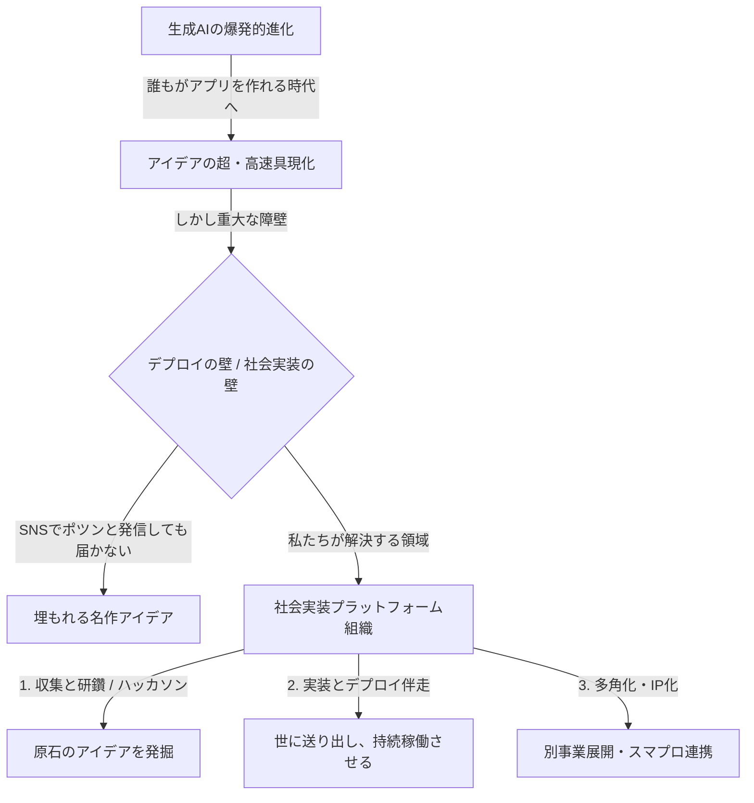

# 🚀 【未来ビジョン構想】学生AIハッカソン運営から「0→1社会実装組織」への軌跡

本資料は、発起人である田窪氏と三品氏のブレインストーミング（対談）から生まれた、**「運営事務局を0から立ち上げ、将来的な法人化を見据えた『個人のアイデアをAIで社会実装する組織・文化』へと進化させる」**という壮大な構想を、美しく体系的にまとめたコンセプト・ドキュメントです。

学生が最高にワクワクし、かつ「実際に走り出しているリアルな熱量」を感じられる絶妙なラインでビジョンを整理し、優秀な高学年（3〜4年生）や理系ギーク層を引き付けるための最強の共通認識（マニフェスト）としてご活用ください。

---

## 🧭 ビジョン＆ミッションの定義

対談で合意されたコアとなる理念とパーパスを、より社会的価値の高い言葉に昇華させました。

| 項目 | 構想（対談での言葉） | 昇華されたコーポレート・アイデンティティ |
| :--- | :--- | :--- |
| **ミッション** | 一人一人が持つアイデアを社会に実装する組織 | **「一人ひとりの『小さなひらめき』を、AIの力で世界へ届ける」**<br>〜個人のアイデアの社会実装を民主化する〜 |
| **事業の本質** | アプリを作っても出す場所がない。<br>それを世の中に出すのを手伝う。 | **「デプロイの壁（社会実装の壁）」の突破支援**<br>AIで「誰でも作れる」時代だからこそ、作った後の「世に届ける・持続させる」プロセスを伴走する。 |
| **運営のスタンス** | どんな小さい声も拾える。<br>ちっちゃいのが「きれいごと集め」しよう。 | **「小さな声をこぼさない、きれいごとの社会実装」**<br>市場規模や資本の論理で切り捨てられてきた個人や小さなコミュニティの「あったらいいな」を、AIテクノロジーで確実に形にする。 |

---

## 💡 コア・ストーリー：なぜ今、この活動が必要なのか？

学生やステークホルダーに熱量を持って語るための**ストーリーテリング・フレームワーク**です。



### 1. 「AIによる創作の民主化」と、その先にある「壁」
現在、生成AIやノーコードツールの進化により、プログラミングスキルがない文系学生であっても、自分の作りたいアプリを一瞬で形にできるようになりました。
しかし、ここに**巨大な落とし穴（課題）**があります。
**「作ったアプリを、一体どこに出すのか？ どうやって広めるのか？」**
個人がSNSで「アプリ作りました！」と1回投稿したところで、世の中には届きません。ほとんどの素晴らしいアイデアやプロトタイプは、誰にも使われないままデスクトップの片隅で眠っています。

### 2. 私たちが果たす役割：デプロイ（社会実装）のプロデューサー
私たちは、この「作ったけれど世に出せない」というギャップを埋める存在になります。
関西中の学生からアイデアを募り、ハッカソンを通じて磨き上げ（研鑽）、大企業や地域の信頼（アセット）を繋ぎ合わせることで、**「個人の小さな声を綺麗ごと抜きで集め、実際に社会で使われるサービスにまで育て上げるプラットフォーム組織」**を創ります。

### 3. ハッカソンは「第一歩（エンジン）」に過ぎない
今回開催する学生AIハッカソンは、単なる「一過性のイベント」ではありません。
この組織が目指す「アイデア社会実装プラットフォーム」を検証し、原石となるアイデアと優秀な仲間を集めるための**「最強の事業検証（PoC）エンジン」**です。この授業やハッカソンの運営を通じて、私たちは創業期メンバーとして新しい仕組みとコミュニティを創り上げていきます。

---

## ⚡️ 他のハッカソンとの圧倒的差別化（3つの極大USP）

ありきたりな「コードを書いて、順位をつけて終わり」のハッカソンとの決定的な違いです。

### 1. 成果物の寿命（Living Product）
* **従来**: 「提出して、審査されて終わり」の使い捨て。翌日にはサーバーは停止し、コードはゴミ箱行き。
* **本ハッカソン**: **「イベント後も、世界に向けて稼働し続ける」**。優秀なプロダクトは、事務局がその後のホスティングや運用支援を行い、実際に世にデプロイし続ける受け皿を用意します。

### 2. 評価とバトルのリアルさ（Live User Testing）
* **従来**: 「綺麗なスライドとピッチの一発芸アイデア」による審査。実用性は軽視されがち。
* **本ハッカソン**: **「実ユーザーの感情に直撃するテストローンチ」**。中間発表時にチーム同士が実際にアプリを使い合う「体験テストセッション」を設置。リアルなユーザーFBの獲得数も審査対象にします。

### 3. チーム結成の科学（0→1 Team Synergy）
* **従来**: 友達同士の内輪ウケ、または技術や熱量のミスマッチが起きやすい「適当な放置マッチング」。
* **本ハッカソン**: **「プロレベルの多職種（PM×エンジニア×デザイナー）マッチング」**。運営側が熱量と役割の相性を分析し、0→1開発で最もシナジーが出る混成チームを科学的に結成します。

---

## 🗺 将来の事業展開ロードマップ（多角化とIP化）

事務局メンバーが「一イベントのスタッフ」ではなく「新組織の創業期メンバー」としてコミットしたくなる、具体的な成長シナリオです。

### 📈 3段階の組織・事業進化シナリオ

```
【Phase 1: エンジンの始動（2026年）】
   ▼ 学生AIハッカソンの開催（30名 → 50名 → 80名とスケール）
   ▼ 運営事務局のコミュニティ化と「アイデア収集・研鑽」の仕組み構築
   ▼ 大企業（QUINTBRIDGE等）との信頼関係（アセット）の確立
   
【Phase 2: 法人化とプロダクト化（2026年後半〜2027年）】
   ▼ 運営事務局を「一般社団法人」または「株式会社」へと正式に法人化
   ▼ ハッカソンで生まれた優秀なアプリ・アイデアの「IP化（知的財産化）」
   ▼ アイデアの本格デプロイ（実証実験・稼働サポート）

【Phase 3: 多角化とエコシステム拡大（2027年〜）】
   ▼ 別の事業展開の統合（例：「スマプロ」等の教育・地方創生プロジェクトの吸収・シナジー創出）
   ▼ 自社IPを活用した教育コンテンツや開発支援ビジネスへの展開
   ▼ 関西発、日本全国へと展開する「アイデア社会実装プラットフォーム」の完成
```

---

## 📣 スマートな草の根集客戦略（オーガニック＆コミュニティ）

予算や大人のネットワークに頼り切らず、自分たちの力で確実に80名を集めるためのスマートなファネル設計です。

* **Connpass勉強会を起点とする「ミニ体験ハンズオン」の定期開催**：
  「Cursorを使って1時間でAIアプリを作る」などのハードルの低いミニイベントをConnpass等で無料開催。そこに参加した学生との信頼関係を作り、本戦ハッカソンへとコンバージョンさせます。
* **主要大学の研究室・サークルへの「草の根アウトリーチ」**：
  情報系やロボット、ビジネス、デザインなどの主要大学ゼミやサークルに対し、運営メンバーがSNSのDMや知人伝いで直接アプローチ。地道な口コミ（バイラル）を発生させます。

---

## 🎯 学生への「ギリ嘘じゃない」最強の口説き文句（対話ベース）

説明会や個別面談で、学生の心を鷲掴みにするための具体的なトークスクリプトと訴求ポイントです。

> ### 🗣️ 語りかける言葉（ピッチ・スクリプト）
> 「ねえ、みんな。ぶっちゃけていい？
> 今ってAIを使えば、文系理系関係なく、誰でも数時間で動くアプリが作れるじゃん。
> でもさ、**『作ったところで、それどうやって世の中に出すの？』**って思わない？
> 自分でX（Twitter）に『作りました！』ってURL貼ってポストしたところで、インプレッションは数十回、身内に使われて終わり。それが現実だよね。せっかくのワクワクするアイデアが、誰にも届かずに消えていくの、めちゃくちゃもったいなくない？
>
> だから、僕たちはこの状況を変えるための**『新しい組織』**を創ることにした。
> 理念はね、**『一人ひとりが持つ小さなアイデアを、AIの力で綺麗ごと抜きで社会に実装する組織』**。
>
> 誰もがアイデアを出し合って、それをみんなで磨いて、本物の実ユーザーに使ってもらって、本当に世の中にデプロイして稼働させ続ける。そんなワクワクする場所を本気で作る。
>
> 実は、今回みんなを募集しているハッカソンの運営事務局は、ただのイベントスタッフじゃない。**この組織を0から創り上げ、文化を作る『創業期メンバー』なんだよね。**
> すでにQUINTBRIDGEっていう最高にカッコいい舞台は用意してある。僕たちのこのビジョンも、すでに裏で少しずつ動き出しているプロジェクトの一環なんだ。
>
> 用意されたサークルで先輩の保守をするか、それとも僕たちと一緒に、この新しい『社会実装組織』の創業期メンバーとして、本気で世の中驚かせるか。
> 一生に一度の学生生活、どっちがワクワクする？ 一緒に走り抜けよう！」

---

> [!TIP]
> **💡 次のアクションへの推奨案**
> この「0→1の創業期メンバー」としての見せ方と、強力な3つのUSPによって、メンバー募集および参加者集客の熱量が極限まで高まりました。
> 続いて、この熱量をそのままダイレクトに伝えるための**「SNS（X/LINE）募集告知テキスト」**や、**「応募エントリーフォーム」**の作成に進むことを強くお勧めします。
