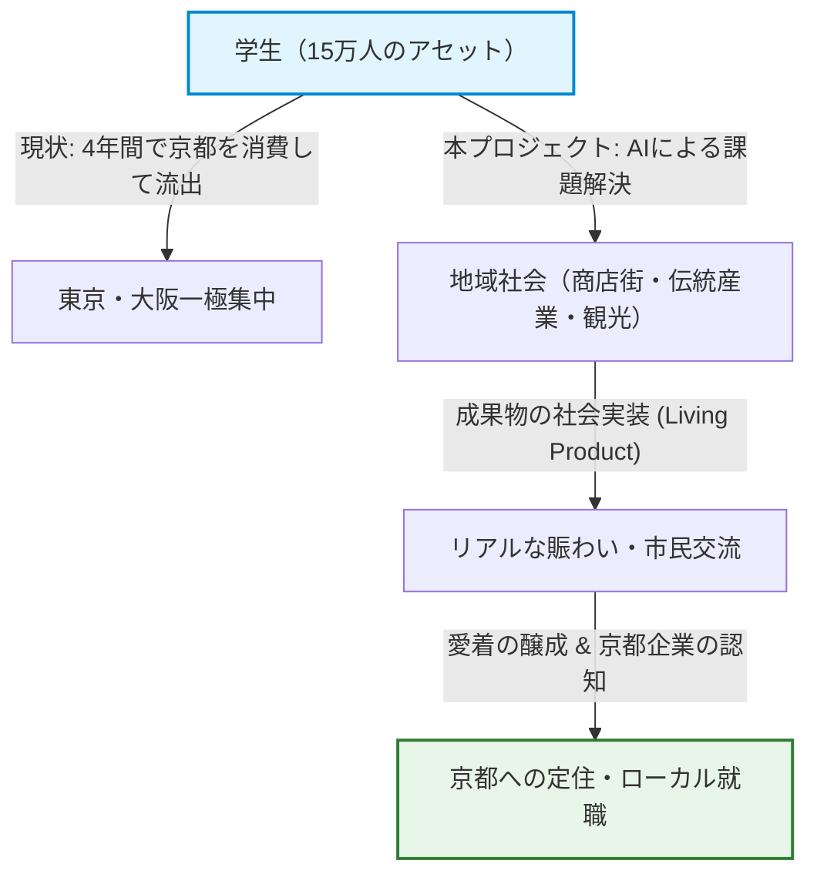
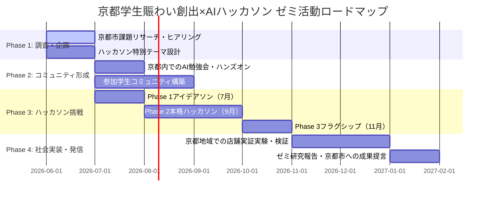

# 🗺️ 【京都・若者賑わい創出×AI社会実装ハッカソン】ゼミ連携プロジェクト企画提案書

本提案書は、当ゼミの主要テーマである**「学生・若者の賑わい創出」**と、先端テクノロジーを活用した**「学生AIハッカソンイベント（DISRUPT AI Hackathon (with KANSAI)～Create Liberal＆Sciences～）」**を融合させ、京都市のリアルな地域課題を解決するための実践的プロジェクト計画です。

---

## 📌 第1章：背景と京都市の課題リサーチ

京都市は全国屈指の「学生の街」でありながら、構造的な人口流出問題に直面しています。以下にその実態と要因を整理します。

### 1. 「大学のまち・学生のまち」の現状
- **全国トップの学生比率**: 京都市の人口に占める大学生・短期大学生の割合は約**10%**（約15万人）であり、政令指定都市の中で圧倒的1位です。
- **知的アセットの集積**: 京都大学、同志社大学、立命館大学、京都工芸繊維大学など、文理問わず優秀な頭脳が狭い地域に高密度で集積しています。

### 2. 直面する「若者・学生の流出問題」
- **深刻な転出超過**: 京都市は近年、若年層（特に20〜24歳）の転出超過が著しく、全国の自治体の中でも人口減少問題が極めて深刻です。
- **「卒業後の東京・大阪流出」**: 毎年春、多くの学生が京都の大学を卒業すると同時に、就職のために東京圏（一極集中）や大阪府へ流出しています。

### 3. なぜ学生は京都を去るのか？（3大要因）

| 要因分類 | 具体的な実態と課題 |
| :--- | :--- |
| **① キャリア・求人のミスマッチ** | IT、スタートアップ、コンサルティングなど、若者が希望する「最先端かつ高待遇な職種」の多くが東京に集中している。京都には世界的な製造業（任天堂、京セラ、村田製作所等）があるものの、文系・理系問わず学生との日常的な接点や、若手向けスタートアップの選択肢が十分に見えていない。 |
| **② 技術と実践を試す「場」の不足** | 大学の講義や研究室での学びは深くても、それを活かして「自ら0→1でプロダクトを創り、社会で稼働させる」という実践的なイノベーション・コミュニティが京都内に少なく、活発な学生ほど東京のコミュニティへ吸い寄せられる。 |
| **③ 地域への帰属意識（シビックプライド）の未醸成** | 多くの学生にとって京都は「4年間を過ごす一時的な消費の場（住まい・観光）」に留まっており、街の課題解決に主体的に関わる機会がないため、卒業時に「この街に残り、貢献したい」という動機が生まれにくい。 |

---

## 🧭 第2章：本プロジェクトの意義と目的

この課題に対し、ゼミが主体となって「AIハッカソン」のムーブメントを京都に呼び込むことには、極めて高い社会的意義と明確な目的があります。

### 1. プロジェクトを行う意義



*   **「消費する学生」から「共創する市民」への転換**
    学生がAIという強力な武器を手にし、京都のリアルな街の課題を解決する側に回ることで、「自分たちがこの街を動かしている」という強い当事者意識（シビックプライド）を育みます。
*   **京都でしか不可能な「テック×文化」イノベーション**
    京都の持つ最大の強みである「歴史・伝統産業・観光」というアセットと「生成AI」を掛け合わせることで、東京のコピーではない**「京都ならではの独自プロダクト」**を創出し、ローカルからイノベーションを起こせることを証明します。

### 2. プロジェクトの目的
1.  **「大学の壁」を越えた、京都発の自立的AIコミュニティの形成**
    大学ごとのセクショナリズムを排除し、京都中の文理の学生が協働する「知的な賑わいの渦」を創ります。
2.  **ハッカソン成果物を実際に京都の街へデプロイ（社会実装）する**
    イベントの「一発芸」で終わらせず、ゼミの伴走支援によって京都の店舗や商店街に実装し、実利を伴う賑わいを生み出します。
3.  **学生と京都企業・スタートアップの密なエンゲージメントチャネルの構築**
    京都の魅力的な企業や行政と学生がワンチームで開発することで、地元就職やローカル起業という選択肢を提示します。

---

## 🛠️ 第3章：具体的な解決プラン

ハッカソンイベント（DISRUPT AI Hackathon (with KANSAI)～Create Liberal＆Sciences～）をフックとして、以下の3つのソリューションを実行します。

### 1. 京都のリアルな課題を解く「京都活性化特別テーマ（トラック）」の設定
ハッカソンにおいて、京都の課題に特化したテーマを設定し、学生にソリューションを開発させます。

- **テーマ案A：【観光×AI】スマート・デプロイ観光**
  - **課題**: 一部エリアのオーバーツーリズム（混雑）と、周辺エリア・地元商店街の認知不足。
  - **解決策**: AIを用いて観光客の気分やリアルタイム混雑状況から「今行くべき隠れた名店・スポット」をパーソナライズ提案し、回遊と消費を促進するツール。
- **テーマ案B：【伝統産業×AI】AI職人アシスタント＆グローバル発信**
  - **課題**: 後継者不足と、海外向けマーケティング・魅力発信のノウハウ不足。
  - **解決策**: 職人の暗黙知や技法を学習させた対話型AIアシスタントの構築や、多言語での魅力発信・越境ECを半自動化するクリエイティブAIツールの開発。
- **テーマ案C：【学生生活×AI】超大学スマートハブ**
  - **課題**: 15万人もの学生がいながら、大学間の交流や日常的な繋がりが希薄。
  - **解決策**: 学術的関心や趣味、地域活動の興味関心をもとに、AIが大学の枠を超えてマッチングし、共同プロジェクトやサークル活動を誘発するプラットフォーム。

### 2. 京都ローカルエコシステムとのアライアンス（連携）
- **地元企業メンターの招聘**: 京都のスタートアップ経営者や、伝統産業の若手跡継ぎ、地元企業の技術者をハッカソンのメンター・審査員として招聘。
- **京都市行政との連携**: 京都市のオープンデータ（観光・交通・地域）をハッカソンで活用できるよう調整し、行政課題に対する学生視点からの提言を行います。

### 3. 「Living Product（生き続ける成果物）」の実装モデル
ゼミの強みを活かし、ハッカソンで生まれたプロトタイプを以下のプロセスで「実社会にデプロイ」します。

```
【ハッカソン】       【体験テスト】       【ゼミ伴走期間】       【実社会デプロイ】
アイデア創出   --->  来場者による   --->  店舗・地域と  --->  京都の街で
＆プロトタイプ       実稼働テスト          実証実験調整         稼働・賑わい創出
```

---

## 🗺️ 第4章：今後のゼミ活動ロードマップ（2026年6月〜2027年2月）

ハッカソン開催前の準備期から、開催後の社会実装期にいたるまで、ゼミの活動年間計画を定義します。



### 📅 各フェーズの詳細月次計画

#### 【Phase 1：調査・企画・アライアンス期】（2026年6月〜7月）
*   **目標**: 京都のリアルな課題の解像度を上げ、ハッカソンの枠組みを確定させる。
*   **活動内容**:
    *   **6月**: 京都市の基本計画や人口動態レポートの調査。地域の商店街や伝統産業の工房を訪問し、「何に困っているか」の生の声を聞くヒアリング調査。
    *   **7月**: ハッカソン運営事務局（DISRUPT）と連携し、ハッカソン内に「京都活性化トラック」のテーマを正式設置。協力してくれる地元企業（メンター・審査員候補）へのアプローチ。

#### 【Phase 2：事前学習・草の根コミュニティ形成期】（2026年7月〜8月）
*   **目標**: ハッカソンの参加者となる京都の学生を惹きつけ、AIスキルの底上げを図る。
*   **活動内容**:
    *   **7月〜8月**: 京都の大学周辺（あるいはコワーキングスペース）にて、Connpassを活用した「Cursor×生成AIで京都の課題を解決するプロトタイプ作成ハンズオン」を無料開催。
    *   **8月**: 京都市内の学生向けDiscordコミュニティを立ち上げ、大学や文理を越えたチーム結成（PM・エンジニア・デザイナー）の事前マッチングを支援。

#### 【Phase 3：ハッカソン本戦・検証期】（2026年7月・9月・11月）
*   **目標**: 開発から実ユーザーによるテストローンチまでを体験し、プロダクトを完成させる。
*   **活動内容**:
    *   **7月後半**: ハッカソンPhase 1（1Dayアイデアソン）に参加。京都の学生チームがアイデアの基礎を検証。
    *   **9月**: ハッカソンPhase 2（2Day本格ハッカソン）への参加。実稼働プロトタイプを開発し、中間テストセッション（Live User Testing）でフィードバックを得る。
    *   **11月**: ハッカソンPhase 3（統合型フラグシップイベント）への進出。来場者や地元関係者を巻き込んだ体験テストセッションを実施し、最優秀プロダクトを目指す。

#### 【Phase 4：社会実装・実証実験・成果報告期】（2026年12月〜2027年2月）
*   **目標**: プロダクトを京都の街へ社会実装し、プロジェクトの成果をアカデミックに報告する。
*   **活動内容**:
    *   **12月〜1月**: ハッカソンで生まれた優秀なプロダクト（例：観光誘客ツール等）を、協力商店街や実際の店舗に導入。ゼミ生が伴走して実証実験を行い、利用データや賑わい創出効果を測定（Living Productの実践）。
    *   **2月**: 実証実験の結果をまとめた「ゼミ研究報告書」の作成。京都市の産業観光局や関係機関へ、ハッカソン発プロダクトを通じた「若者の賑わい創出に関する提言」をプレゼン発表。

---

## 📈 第5章：期待されるアウトカム（成果）

本プロジェクトを通じて、関わるすべてのステークホルダーに以下のような価値を提供します。

1.  **参加学生（ゼミ生含む）にとっての成果**
    - **「ガクチカ」を超えた実績**: 最新AIツールの使いこなしから、課題調査、地域調整、開発、実際のリリース・効果検証にいたる「ビジネスの0→1サイクル」を回したという、就職活動でも圧倒的に評価される実力証明。
    - **強力な人脈**: 他大学の優秀層、および京都の地元企業やスタートアップ経営者との深いつながり。
2.  **地域社会（京都市・商店街・企業）にとっての成果**
    - **リアルな賑わいの創出**: 観光地の混雑緩和や、隠れた地元店舗への学生・観光客の流入。
    - **若手人材の獲得機会**: ハッカソンを通じて学生の熱量と技術力を直接見ることで、優秀な地元学生をインターンや採用に繋げるパイプの獲得。
3.  **大学・ゼミにとっての成果**
    - **社会的評価の向上**: 単なる机上の理論に留まらない、「産学公連携の社会実装型イノベーションゼミ」としての高い実績とプレゼンスの確立。
